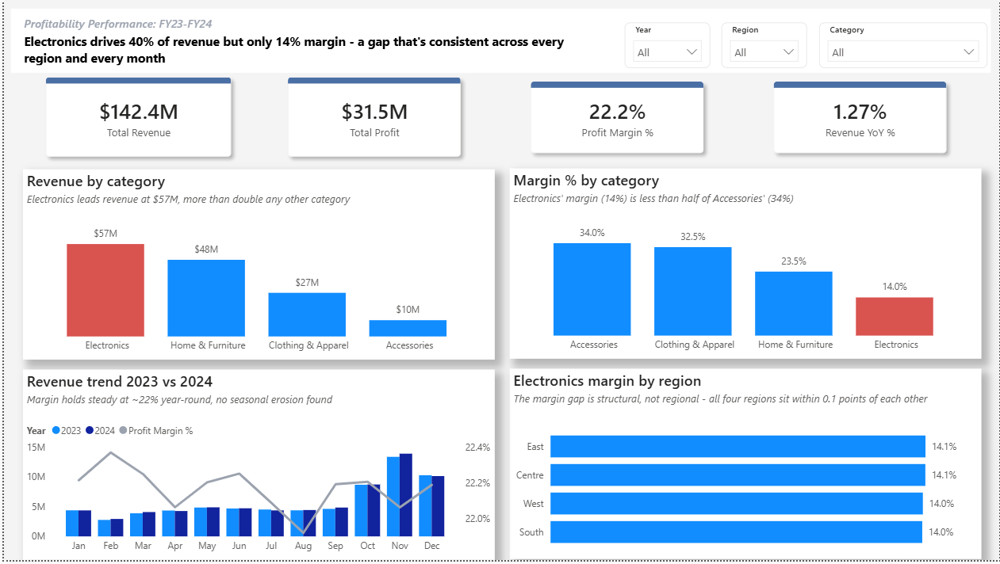
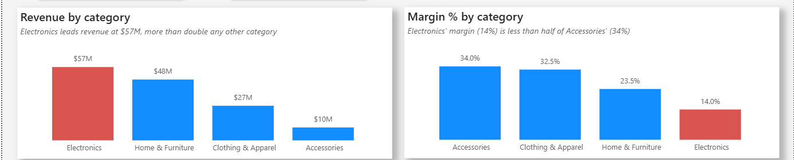
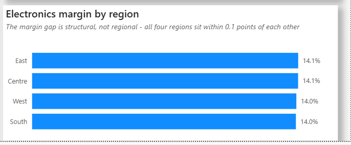
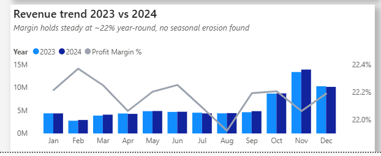

# Profitability Performance Dashboard: FY23 to FY24

Electronics generates 40% of our revenue, but converts it into profit at less than half the rate of every other category, a 14% margin against 23% to 34% elsewhere. And it's not one weak region or a slow month pulling that number down. The gap holds steady across every region and every month of the year, which points to something structural, likely pricing or cost related, not something a regional or seasonal fix will solve.

If you'd like to interact with the dashboard, the file can be found in `/power-bi`.

---

## 1. Background and Overview

This dashboard was built for a VP of Finance and Merchandising deciding where next year's merchandising and marketing budget should go, not just what's selling, but what's actually generating profit.

Revenue alone can be misleading. A category can post strong top line numbers and still be a weak contributor to the bottom line, and that gap often stays hidden until someone actually breaks the numbers apart by category, region, and time period. That's the gap this dashboard is built to close.

These questions didn't come first. They took shape after an initial pass through the data, once we had a sense of what story it was actually telling. From there, they became the guide for chasing the "why" behind the numbers, and for making sure the analysis actually answered what the stakeholder needed.

Questions we wanted answered:

* Which categories are generating profit, versus which ones are just generating volume?
* Is the Electronics gap concentrated in a specific region, or is it happening everywhere?
* Does profit margin hold up during the holiday rush, or does it erode under higher volume?
* Based on the answers, where should next year's investment actually go?

## 2. Data Structure Overview

The dataset covers 200,000 transactions between January 2023 and December 2024. Each row represents a single sale, with category, region, quantity, revenue, and profit attached at the transaction level.

Before analysis, the data was cleaned and structured in Power Query:

* Standardized the date field so every transaction rolls up correctly by year, month, and quarter.
* Built profit margin as a proper aggregate measure, total profit divided by total revenue, rather than averaging row level percentages, which would have skewed the number toward whichever category had the highest transaction count.
* Added year, month, and quarter fields to support the trend analysis.

**A few limits worth flagging:**

* There is no reliable way to track individual customers in this dataset. Names repeat across different people, so any claim about repeat customers or customer loyalty would not hold up. That question is intentionally left out of this report.
* Profit margin within Electronics is nearly identical across every sub category, laptops, phones, tablets, and so on, which suggests the margin was generated at the category level rather than the product level. Findings here are scoped to the category level, where the signal is reliable.

## 3. Executive Summary

Over FY23 and FY24, the business generated **$142.4M in revenue** and **$31.5M in profit**, a 22.2% overall margin, with revenue up 1.27% year over year.

The core finding: Electronics is simultaneously our largest revenue driver and our weakest margin performer. It accounts for 40% of total revenue ($57M) but converts at just 14%, less than half the rate of the other three categories (23% to 34%). Accessories sits at the opposite end of that spectrum, the smallest revenue category at $10M, but the strongest converter at 34%.

This isn't isolated to a region or a season. Electronics' margin holds within a tenth of a percentage point across all four regions (14.0% to 14.1%), and overall company margin barely moves across the year, 22.15% during the October through December peak versus 22.17% the rest of the year, even as revenue triples in that window. The business isn't discounting its way through the holidays to hit those numbers.

**Suggestion for the VP:** growing Electronics revenue further won't fix this. The issue isn't volume, it's conversion, how much of each sale actually turns into profit. The higher leverage move is understanding why Electronics converts so poorly (pricing, supplier cost, something in the category's cost structure) and reconsidering how much of next year's budget goes to Accessories, which already converts at the highest rate in the portfolio and currently receives the smallest share of investment.

## 4. Insight Deep Dive

### 4.1 Our biggest seller isn't our biggest earner

Electronics leads revenue at $57M, more than double the next closest category. But it converts that revenue into profit at less than half the rate of the other three, a 14% margin versus 23% to 34% elsewhere. Accessories sits at the other extreme: only $10M in revenue, the smallest of the four categories, yet it converts at the highest rate, 34%. Rank the categories by revenue and by margin side by side, and the order nearly flips. That inversion, our top revenue category being our weakest earner, is the core tension this whole report is built around.

### 4.2 It's not a regional problem

If Electronics' weak margin were being driven by regional factors, higher shipping costs in one market, more aggressive local pricing, inconsistent execution, we'd expect to see real variation across regions. We don't. East, West, South, and Centre all land within a tenth of a percentage point of each other, all around 14%. That consistency is itself the finding: whatever is compressing Electronics' margin is happening at the same rate everywhere, which rules out a regional promotion or a market specific pricing adjustment as the fix. This needs to be solved at the category level, company wide.

### 4.3 The holiday rush doesn't cost us margin

Revenue climbs sharply in the fourth quarter. November alone brought in $13.37M in 2023 and $13.90M in 2024, both roughly three times a typical month's revenue of about $4.3M. In a lot of retail businesses, that kind of spike comes with a margin cost, heavier discounting to move volume. That's not the case here. Margin holds in a tight 22.0% to 22.4% band across the entire year, holiday period included. The added volume isn't being bought with lower prices, which means there's room to invest further into Q4 without that investment eating into profit, once the underlying Electronics margin issue is addressed.

## 5. Recommendations

1. **Investigate why Electronics converts at such a low rate before spending more to sell more of it.** It's already the top revenue category. The problem isn't demand, it's conversion, and that's a pricing or supplier cost conversation, not a marketing one.

2. **Shift a larger share of next year's budget toward Accessories.** It's the smallest category by revenue but the strongest by margin, and it's currently the most under invested category relative to how well it actually performs.

3. **Don't approach the Electronics problem region by region or season by season.** The margin gap is consistent everywhere, all year. Any fix needs to be applied at the category level, not through a regional promotion or a holiday pricing adjustment.

4. **Once the Electronics margin issue is addressed, scale into Q4 with confidence.** The data shows the holiday rush isn't being bought with lower margin, so the seasonal spike itself isn't the risk. Just make sure the category driving that spike isn't scaled up before its underlying margin problem is fixed.
